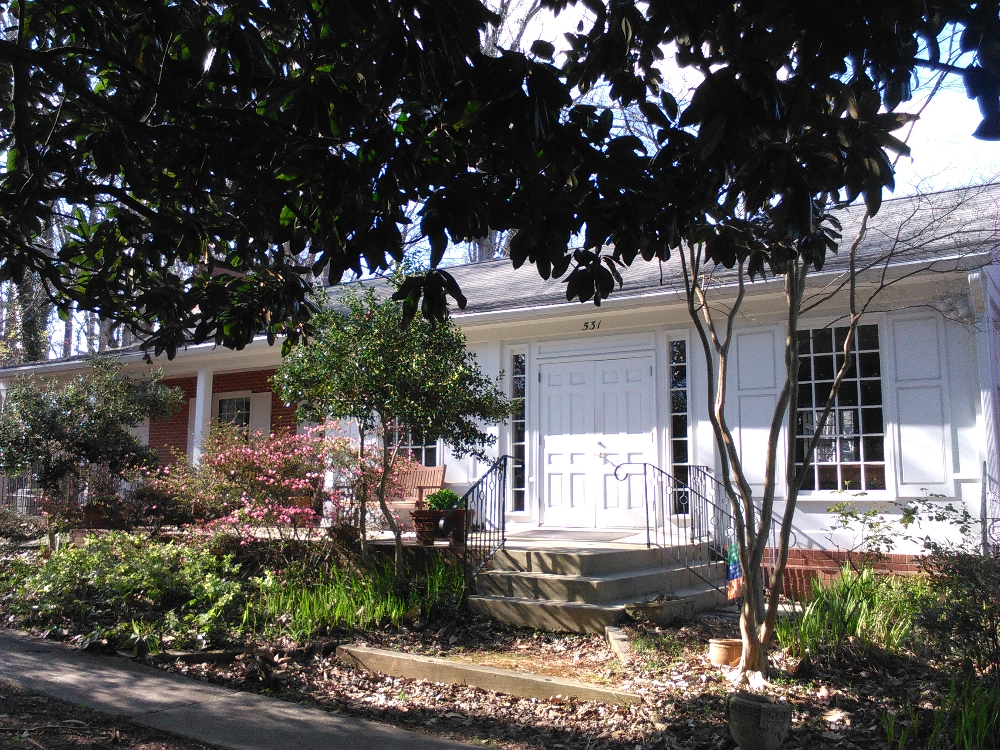



  

    

      
    

    

      <h1>Chapel Hill Friends Meeting</h1>
    

  

  

    

      <h1>Welcome</h1>
      
The Chapel Hill Friends is an unprogramed meeting established in 1937. We are a member of the <a href="https://www.fgcquaker.org/cloud/piedmont-friends-fellowship-and-yearly-meeting">Piedmont Friends Yearly Meeting</a>.

      
Our <a href="{{ site.baseurl }}/visit-and-learn">Visit and Learn</a> and our <a href="{{ site.baseurl }}/Q101/">Quakerism 101</a> pages have basic information about what to expect at a Quaker Meeting for Worship. If you have additional questions or would like to know more about Quakers, feel free to <a href="{{site.baseurl}}/contact">contact us</a> and be sure to <a href="#" id="newsPop" data-toggle="popover" data-placement="top">sign up for our weekly email newsletter</a>.

      
Want to visit?
        <a class="d-sm-inline d-none noIcon" href="#" data-toggle="modal" data-target="#visitCHFM">
          Here’s a map 
        </a>
        <a class="d-sm-none d-inline" href="https://goo.gl/maps/YShvAXQGwSL2">Here’s a map</a>.
      

      

        

          

            

              <h5 class="modal-title" id="visitCHFMLabel">Map</h5>
              <button type="button" class="close" data-dismiss="modal" aria-label="Close">
                &times;
              </button>
            

            

              <iframe src="https://www.google.com/maps/embed?pb=!1m14!1m8!1m3!1d3231.4272848958494!2d-79.040614!3d35.91204!3m2!1i1024!2i768!4f13.1!3m3!1m2!1s0x0%3A0xc690b7a12fb90e69!2sChapel+Hill+Friends+Meeting!5e0!3m2!1sen!2sus!4v1550611311696" width="450" height="450" frameborder="0" style="border:0" allowfullscreen></iframe>
            

            

              <button type="button" class="btn btn-secondary" data-dismiss="modal">Close</button>
              <a class="btn btn-success noIcon" href="https://goo.gl/maps/YShvAXQGwSL2">Open in Google Maps</a>
            

          

        

      

      
      {{ schedule-include | markdownify }}
    

    

      <h1>Currently</h1>
      

        <a class="twitter-timeline" data-height="470" data-theme="dark" data-chrome="transparent nofooter noheader noborders" data-link-color="#7BC679" href="https://twitter.com/chfm_quakers?ref_src=twsrc%5Etfw">Tweets</a> 
        <small>tweets by <a href="https://twitter.com/chfm_quakers?lang=en">@chfm_quakers</a></small><!-- this line is to meet twitter usage guidelines -->
      

    

    

      
<i>We joyfully embrace the full spectrum of the light within, made visible through the participation of people of all beliefs, cultures, backgrounds, abilities, ethnicities and races, sexual orientations, and gender identities.</i>

    

  


