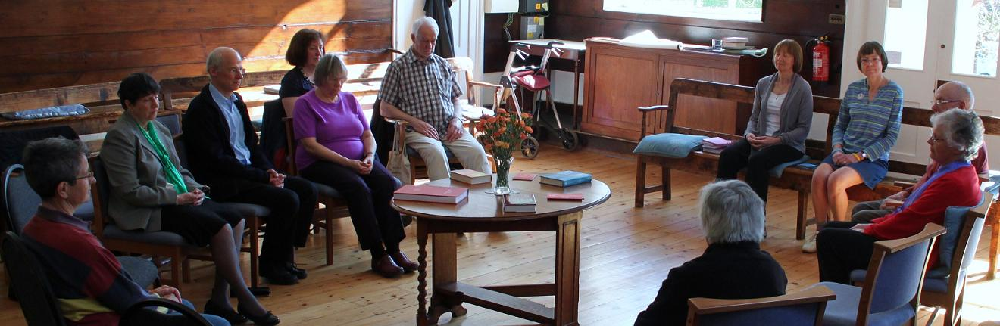

<head>
  
</head>

  

    

      
    

    

      Chapel Hill Friends Meeting
    

  

  

    
      

        <h2>{{ item.title }}</h2>
        
{{ item.text }}

        <a href="{{site.baseurl}}{{ item.link }}">{{ item.linkText }}</a>
      

    
  

